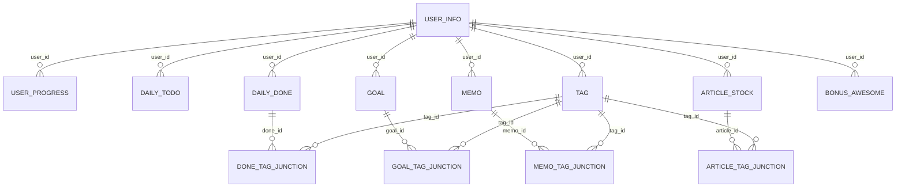
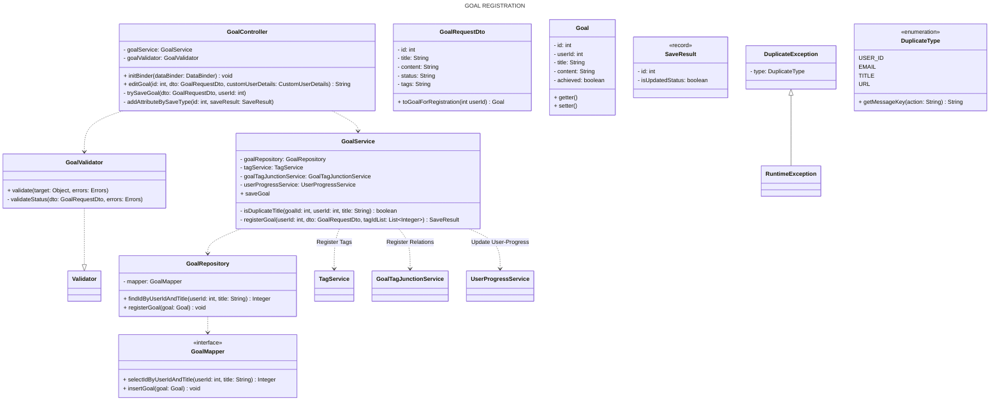
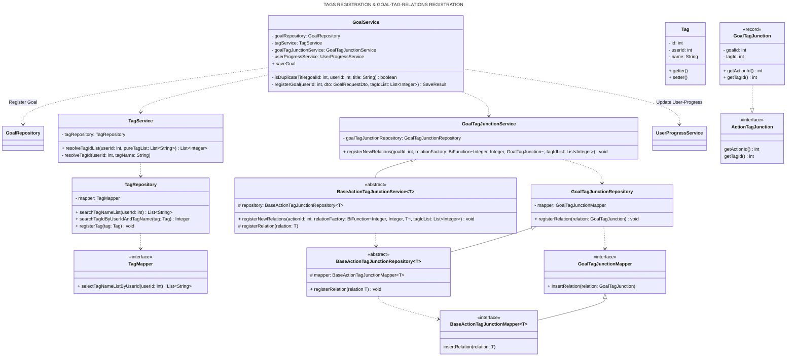

# えらいコレクト
<p align=center>
  
</p>
<br/>

## はじめに
- 本リポジトリは、Java学習者の「ゆうき」（Xアカウント： [@yk00pg](https://x.com/yk00pg)）が作成したWebアプリ『えらいコレクト 〜自己肯定感を高める学習記録アプリ〜』に関するものです
- ご利用いただくことによるトラブル等につきましては、一切の責任を負いかねますことを予めご了承ください
  <br/>
  <br/>

## 🔖 目次
- [アプリURL](#-アプリurl)
- [背景](#-背景)
- [コンセプト・概要](#-コンセプト概要)
- [想定ユーザー](#-想定ユーザー)
- [機能一覧](#-機能一覧)
- [デモ動画](#-デモ動画)
- [えらい！獲得条件](#-えらい獲得条件)
- [ER図](#-ER図)
- [シーケンス図](#-シーケンス図)
- [クラス図](#-クラス図)
- [工夫したところ](#-工夫したところ)
- [環境・使用技術](#-環境使用技術)
- [今後実装予定の機能](#-今後実装予定の機能)
- [おわりに](#おわりに)
  <br/>
  <br/>

## 🌐 アプリURL
<!-- アプリURL貼る -->
（期間限定での公開を予定しており、予告なく公開を停止する場合がございます）<br/>
<br/>

## ❓ 背景
### 🌀 学習中の落ち込み期
学習を続けていると、定期的に落ち込み期が訪れます。<br/>
この期間に突入すると、なぜかネガティブな考えばかりが浮かび、心に居座ってじわじわとやる気と自信を削いでいきます。

- **「自分は本当に頑張れているのだろうか」「このままで良いのだろうか」** と落ち込む
- 学習継続日数や累計学習時間が積み上がっていっても、**学習の実感が湧かず、数字だけが増えていく気がして** 不安になる
- 同じように学習を続けている方のことは「すごいな」「頑張っているな」と思えるのに、**自分のことはそう思えずもやもや**<br/>

ですが、そんな思いに囚われて手が止まってしまっては元も子もないことです。<br/>
そこで、学習日数や学習時間のほかに**自分の日々の頑張りを実感できる指標**
のようなものがあればモチベーションを維持する一助になるのではないかと考え、同じような思いを抱える学習者の方が　**「行動している自分、えらい！」「よし、ちゃんと頑張れている！」と日々の努力を実感し、自分を認めてあげる**きっかけになればと思い、作成しました。<br/>
<br/>

## 🎯 コンセプト・概要
- 学習にまつわるアクション（学習記録（やること・できたこと）、目標、学習に関するメモ、参考記事）を登録することができる学習記録アプリです
- アクションを登録することにより、**えらい！ポイント**が貯まり、登録時には**えらい！メッセージ**が表示されます
- **えらい！ポイント、学習日数、学習時間を可視化**し、ダッシュボードページにて確認することができます
- 一般的に、小さな成功体験を積み重ねることにより自己肯定感が向上すると考えられていることから、**自分の行動によって獲得したえらい！が増えていく様子や、自分を褒めるメッセージを日常的に目にすることにより**、学習者であるユーザーの**自己肯定感を高める**ことを期待しています<br/>

> [!NOTE]
> このアプリは自己肯定感を高めることによってモチベーションの維持・学習の継続をサポートするものであり、その効果を保証するものではございません。

<br/>

## 👥 想定ユーザー
- 何かしらの学習に取り組んでいる / 取り組もうとしている個人
- 学習中に落ち込み期を経験している / 経験したたことのある個人
  <br/>
  <br/>

## ⚙️ 機能一覧
| 機能 | 詳細 |
|:--|:--|
| **👤 <br/>ユーザー登録機能** | <ul><li>ログインID、ユーザー名、メールアドレス、パスワードで新規登録<br/>（ユーザー名、メールアドレスは任意）</li><li>パスワードはハッシュ化してDBに保存</li><li>登録内容はマイページにて変更可能</li></ul> |
| **🚪 <br/>ログイン・ログアウト機能** | <ul><li>ログインID、パスワードでログイン</li><li>Spring Securityを用いた認証・認可</li></ul> |
| **📝 <br/>アクション登録機能** | <ul><li>学習にまつわるアクションを登録<ul><li>やること（日付、内容）</li><li>できこと（日付、内容、学習時間、メモ、タグ）</li><li>目標（タイトル、内容、進捗状況、タグ）</li><li>メモ（タイトル、内容、タグ）</li><li>記事ストック（タイトル、URL、メモ、閲覧状況、タグ）</li></ul></li></ul> |
| **📊 <br/>ダッシュボード機能** | <ul><li>累計えらい！ポイント（ポイント数、イラストグラフ）</li><li>累計学習日数</li><li>連続学習日数（日数、最後に学習した日）</li><li>累計学習時間</li><li>学習時間グラフ<ul><li>日別学習時間（過去7日分）</li><li>曜日別平均学習時間</li><li>月別学習時間（過去6ヶ月分）</li><li>タグ別学習時間（上位10件、全件）</li></ul></li></ul> |
| **👍 <br/>えらい！ポイント<br/>えらい！メッセージ獲得機能** | <ul><li>学習にまつわるアクションを登録することで、えらい！ポイントを獲得</li><li>アクション登録時（やること・できたことは日付あたり1件目の登録時）に<br/>えらい！メッセージを表示</li><li>アクション登録の継続日数に応じてボーナスえらい！ポイントを獲得</li></ul> |
<br/>
<br/>

## 📽️ デモ動画

https://github.com/user-attachments/assets/bc7d3bd0-8c44-4505-96e5-99ce8eebde5b

<br/>
<br/>

## 👑 えらい！獲得条件
### 通常えらい！ポイント
| 条件 | 1件あたりのポイント | メッセージ |
|:--|:-:|:--|
| やることを登録 | 1えらい！ | やることを決めてえらい！ |
| できたことを登録 | 3えらい！ | 実行できてえらい！ |
| 目標を登録 | 5えらい！ | 目標を立ててえらい！ |
| 目標を達成 | 10えらい！ | 達成できてえらい！ |
| メモを登録 | 5えらい！ | メモに残してえらい！ |
| 記事ストックを登録 | 3えらい！ | 情報を集めてえらい！ |
| 登録した記事を読了 | 5えらい！ | 知識を深めてえらい！ |

### ボーナスえらい！ポイント
| 条件（n日ごと） | 1日あたりの追加ポイント |
|:--|:-:|
| いずれかのアクションを登録 | 1えらい！ |
| 3日連続でいずれかのアクションを登録 | 3えらい！ |
| 7日連続でいずれかのアクションを登録 | 7えらい！ |
| 30日連続でいずれかのアクションを登録 | 10えらい！ |

<br/>
<br/>

## 🟠 ER図
下図は「ユーザー情報」、「ユーザー進捗状況」、「ボーナスえらい！獲得状況」、「各アクション情報」、「タグ情報」、「各アクションとタグの関係性」のテーブル間の関係を表しています。



- ユーザー登録時に自動採番されるuser_info.idを他テーブルのuser_idにFKとして関連付けています
- Spring SecurityのCustomUserDetailsのidとしてuser_info.idを設定しているため、AuthenticationPrincipalからuser_idを参照することができます
- これらの紐付けにより、ユーザー単位での関連データの容易な取得を実現しています
  <br/>
  <br/>

## 🟢 シーケンス図
下図は学習にまつわるアクションのうち『目標』を登録する際のフローを表しています。

- ユーザーリクエスト（フォーム入力 & 送信）により、大まかに分けて「データ確認」「目標登録」、「タグ & 目標とタグの関係性登録」、「ユーザー進捗状況 &
  ボーナスえらい！獲得状況更新」の4つの処理が実行されます

```mermaid
sequenceDiagram
    box USER
        actor User
    end
    box APP
        participant GoalController
        participant GoalService
        participant Tag Registration as TagService<br/>GoalTagJunctionService
        participant User Progress Registration as UserProgressService<br/>BonusAwesomeService
    end
    box DB
        participant Database
    end
    User->>+GoalController: 目標を入力して送信

    Note over GoalController: データ確認（入力データ）
    GoalController->>GoalController: エラー確認
    alt 入力エラーあり
        GoalController->>User: エラーメッセージを表示
    else 入力エラーなし
        GoalController->>+GoalService: 入力データを渡す

        Note over GoalService: データ確認（既存データ）
        GoalService <<->>Database: 既存データとの重複を確認
        alt 重複あり
            GoalService->>GoalController: 処理を中断してエラーを知らせる
            GoalController->>User: エラーメッセージを表示
        else 重複なし
            Note over GoalService: 目標登録
            GoalService->>Database: 目標を登録

            Note over Tag Registration: タグ & 目標とタグの関係性登録
            GoalService->>+Tag Registration: タグ名リストを渡す
            Tag Registration->>-Database: タグ & 関係性を登録

            Note over User Progress Registration: ユーザー進捗状況 & ボーナスえらい！獲得状況更新
            GoalService->>+User Progress Registration: ユーザーIDを渡す
            User Progress Registration->>-Database: 進捗 & 獲得状況を更新
        end

        GoalService->>-GoalController: 保存の種類（登録・更新）を返す
        GoalController->>-User: サクセスメッセージを表示
    end
```

- データ確認は2箇所で実施しています
    - GoalController: DTOアノテーションとカスタムバリデータを通してバリデーションチェック（形式・内容が正しいか）を実施し、エラーを確認します
    - GoalService: DB登録済みデータと照合して重複があるか確認し、例外処理を行います
      <br/>
      <br/>

## 🔵 クラス図
下図は上記シーケンス図で示した「目標登録」「タグ & 目標とタグの関係性登録」「ユーザー進捗状況 & ボーナスえらい！獲得状況更新」の処理を行うクラス間の関係性を表しています。

- 属性、操作はそれぞれ当該処理に関連するもののみ抜粋しております
  <br/>
  <br/>

### 🚩 目標登録



<br/>

### 🏷️ タグ登録 & 目標とタグの関係性登録



※ GoalTagJunctionService, BaseActionJunctionServiceのregisterNewRelationsの引数のBiFunctionは出力上正しくパースされませんが、中身がわかるように"~"
で囲って記載してます<br/>
<br/>

### 👌 ユーザー進捗状況更新 & ボーナスえらい！獲得状況登録


<br/>
<br/>

## ✨ 工夫したところ
### 💖 ユーザーを意識した工夫
- 内容ではなく行動そのものに焦点を当て、学習にまつわるアクションの登録してえらい！を貯めていくことで、学習者が自分の行動を肯定的に受け止められるようにしました
- えらい！を貯めることが目的となってしまわないように過度な演出やゲーム要素は省きつつ、達成感は得られるようにバランスを調整しました
    - 登録時に表示するポップアップウィンドウにアニメーションを加えて動きをつけることで、特別感を演出
    - えらい！ポイントが貯まっていく様子をイラストグラフで表示し、マウスホバー時にアニメーションを加えて動きをつけることで、えらい！が育っていく様子を演出
- ユーザーの心に寄り添った設計を意識し、やること・できたことの入力枠を固定した場合に想定される下記の懸念点を解消するために、入力枠を可変にしました
    - 予定・実行した内容が入力枠に満たないユーザーは空欄の枠を見て「今日も書けることが少ないな」と気分が落ち込んでしまう
    - 入力枠を超える内容を予定・実行しているユーザーは「もっと書けることあるのに！」と不完全燃焼に思う
- ダッシュボードページにてユーザーの努力を可視化し、学習の振り返りをサポートできるようにしました
    - 累計えらい！ポイント・累計学習日数・連続学習日数・累計学習時間を算出して表示
    - 前日に学習ができなかった場合にも誤解が生じないように、連続学習日数とともに最終学習日を併記
    - 数値だけでなく、累計えらい！ポイントはイラストグラフ、学習時間はChart.jsを活用して横棒・縦棒グラフとして可視化することで、直感的な理解を実現
    - Chart.jsのグラフ描画において、不要なラベルを削除し、ツールチップを調整することで視覚的なノイズを排除
- メインメニューやサイドメニュー、編集・削除をアイコンで表現し、直感的に操作できるように工夫しました
- メモの入力フォームにはEasyMDEを活用してマークダウンエディタを実装し、構造的な文章を作成しやすくしています
- ユーザーの心理的負担を減らせるように、エラーページやエラーメッセージを適切に表示しています
    - 入力エラーがあった場合、エラーメッセージをどこがどのように間違っているか「フィールド単位のエラー」と「全体に関わるエラー」に分けて表示することで、入力のストレスを軽減（セキュリティを考慮し、ログインページでは非表示）
    - アプリのデザインに合わせたエラーページを作成し、ユーザーの不安を緩和し、その後の行動を案内
<br/>

### 🔨 技術的な工夫
- 可読性・保守性を意識し、各クラスの責任や役割が明確になるように設計しました
    - Controller / Service / Repositoryの3層構造を採用し、責務を明確化
    - クラス内においても処理ごとにメソッドを細分化あるいはまとめることで、可読性を向上し、各メソッドの役割を明確化
- バリデーションチェック、エラーチェックを種類ごとに三段階に分けて実施し、適切なデータ登録を実現しています（[シーケンス図](#-シーケンス図)参照）
    - 「入力必須」「文字数」「形式」などの単純なバリデーションチェックをDTOアノテーションで実施
    - 「未来の日付不可」「他フィールドの入力に応じて入力必須」などの複雑なバリデーションチェックをカスタムバリデータクラスで実施
    - 「重複不可」「現在のパスワードと入力パスワードの照合」などのDBに登録されたデータとの照合が必要なエラーチェックをサービスクラスで実施
- えらい！ポイント・学習日数・学習時間の集計をダッシュボードアクセス時に限定し、かつ算出したデータをセッションに保持することで、DBへのアクセスを最小限にしています
- 中間テーブルへの関係性の登録処理を共通化し、保守性・再利用性の高いコード設計を心がけました（[クラス図](#-クラス図)参照）
    - 抽象クラスBaseActionJunctionServiceを用意し、BiFunctionを引数に取ることで柔軟な拡張を実現
- Spring Securityの認証情報とデータ取得を紐付けることにより、一貫性のあるデータ取得を実現しています（[ER図](#-ER図)参照）
    - ユーザー登録時にDBで自動採番されるuser_info.idをCustomUserDetailsのidとして設定することでAuthenticationPrincipalからidを参照可能
    - user_info.idを他テーブルの外部キーとして関連付けることで、データの整合性を保証
    - セキュリティを考慮し、認証情報とデータ取得を厳密に紐付け、ログイン中のユーザー以外のデータアクセスを防止
      <br/>
      <br/>

## 🛠️ 環境・使用技術
- **検証済みOS:** Mac OS (Sequoia 15.7.1)
- **バックエンド:**
    - 言語: Java (Oracle OpenJDK 21.0.9)
    - フレームワーク: Spring Boot (3.4.7)
- **フロントエンド:**
    - 言語: HTML (Thymeleaf), CSS, JavaScript
    - ツール: Chart.js (グラフ描画), Tagify (タグ入力補助), EasyMDE (Markdownエディタ)
- **認証:** Spring Security
- **データベース:** MySQL (8.0.42 / Docker, MyBatis)
- **インフラ:** Docker Compose, AWS EC2
- **バージョン管理:** Git, GitHub
  <br/>
  <br/>

## 💭 今後実装予定の機能
- 登録済みタグの名称変更・削除機能
- 獲得したえらい！ポイントの内訳・獲得履歴確認機能
- 登録済みアクションの検索・絞り込み・並び替え機能
- メールアドレス認証によるパスワード再設定機能
  <br/>
  <br/>

## おわりに
- Java学習のアウトプットとして、本リポジトリを公開させていただきました
- ご感想やコメントなどがございましたら、[Xアカウント](https://x.com/yk00pg)までご連絡いただけますと幸いです
  <br/>
  <br/>

最後までお読みいただきありがとうございました。
