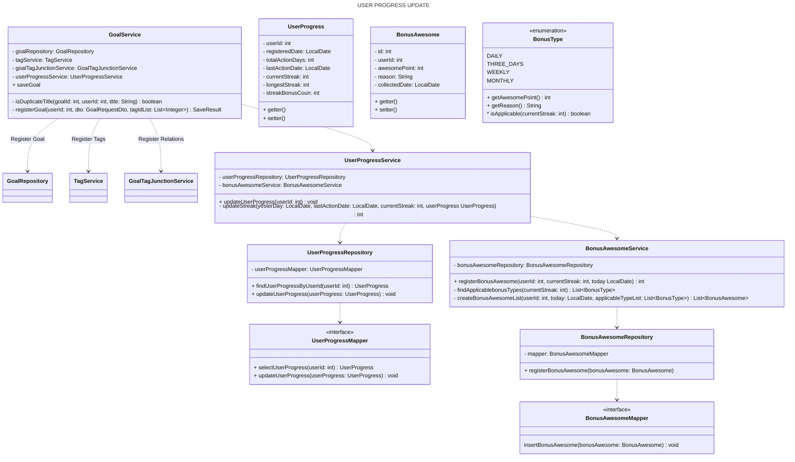

# えらいコレクト

<br/>

## はじめに
- 本リポジトリは、Java学習者の「ゆうき」（Xアカウント： [@yk00pg](https://x.com/yk00pg)）が作成したWebアプリ『えらいコレクト（学習記録アプリ）』に関するものです
- ご利用いただくことによるトラブル等につきましては、一切の責任を負いかねますことを予めご了承ください
  <br/>
  <br/>

## 🌐 アプリURL
https://www.awesome-collect.com <br/>
- ゲストログイン機能により、ユーザー登録をすることなくアプリをお試しいただくことができます。

>[!CAUTION]
>アプリURLにアクセスした直後は、サーバーの起動や接続遅延により一時的にエラーが表示される場合があります。<br/>
>数秒ほどでログイン画面が表示されますので、そのままお待ちいただけますと幸いです。
<br/>
<br/>

## 🔖 目次
- [デモ動画](#-デモ動画)
- [制作背景](#-制作背景)
- [コンセプト・概要](#-コンセプト概要)
- [想定ユーザー](#-想定ユーザー)
- [開発環境・使用技術](#%EF%B8%8F-開発環境使用技術)
- [機能一覧](#%EF%B8%8F-機能一覧)
- [ER図](#-er図)
- [インフラ構成図](#-インフラ構成図)
- [機能紹介](#-機能紹介)
    - [1. ユーザー新規登録機能](#1--ユーザー新規登録機能)
    - [2. ログイン・ログアウト機能](#2--ログインログアウト機能)
    - [3. ゲストログイン機能](#3--ゲストログイン機能)
    - [4. 学習アクション登録機能 & 5. タグ付け機能](#4--学習アクション登録機能--5-%EF%B8%8F-タグ付け機能)
        - [シーケンス図](#-シーケンス図例-目標登録)
        - [クラス図](#-クラス図ユーティリティークラスは除く)
    - [6. ダッシュボード機能](#6--ダッシュボード機能)
    - [7. えらい！ポイント & えらい！メッセージ獲得機能](#7--えらいポイント--えらいメッセージ獲得機能)
- [工夫したところ](#-工夫したところ)
    - [ユーザーを意識した工夫](#-ユーザーを意識した工夫)
    - [技術的な工夫](#-技術的な工夫)
- [今後実装予定の機能](#-今後実装予定の機能)
- [おわりに](#おわりに)
  <br/>
  <br/>
  <br/>

## 🎥 デモ動画

https://github.com/user-attachments/assets/f098c3ec-2882-4bb8-bb85-f70fc2ca7ddd

<br/>
<br/>

## ❓ 制作背景
- 学習を続けていくなかで定期的に訪れる**落ち込み期**に着目し、不安な思いに囚われて手が止まりそうになった際に、学習日数や学習時間のほかに**自分の日々の頑張りを実感できる指標**のようなものがあればモチベーションを維持する一助になるのではないかと考えました
- 本アプリを通して自分の日々の行動を褒めることで、**「よし、ちゃんと頑張れているぞ！ この調子で引き続き頑張ろう！」** と **自分の頑張りを認め、自身を鼓舞する**きっかけになれば良いなと思い、作成しました

<br/>
<br/>

## 🎯 コンセプト・概要
- 学習にまつわるアクション（やること・できたこと・目標・メモ・記事ストック）を登録することで**えらい！ポイント**が貯まり、**えらい！メッセージ**が表示される『学習記録アプリ』です
- 獲得した**えらい！ポイント、学習日数、学習時間**を**数値やグラフ**で確認することができます
- **自分の行動によって獲得したえらい！が増えていく様子や、自分を褒めるメッセージを日常的に目にする**といった小さな成功体験の積み重ねにより、学習者の**自己肯定感を高めて自信を育み、モチベーションの維持・学習の継続をサポートする**ことを目的としています

<br/>
<br/>

## 👥 想定ユーザー
- 何かしらの学習に取り組んでいる / 取り組もうとしている個人
- 学習中に落ち込み期を経験している / 経験したことのある個人

<br/>
<br/>

## 🛠️ 開発環境・使用技術
- **開発環境:** macOS Sequoia(15.7.1), IntelliJ IDEA
- **フロントエンド:**
    - 言語: HTML (Thymeleaf), CSS, JavaScript
    - ライブラリ: Chart.js (グラフ描画), Tagify (タグ入力補助), EasyMDE (Markdownエディタ)
- **バックエンド:**
    - 言語: Java (Oracle OpenJDK 21.0.9)
    - フレームワーク: Spring Boot (3.4.7)
- **認証:** Spring Security
- **データベース:** MySQL (8.0.42 / Docker, MyBatis)
- **インフラ:**
    - AWS EC2 (Amazon Linux 2023)
    - Docker Compose（開発環境: ローカルビルド / 本番環境: GHCR配布イメージ使用）
    - AWS Elastic Load Balancer（SSL終端 & EC2転送・リダイレクト処理）
    - AWS Route 53（独自ドメイン管理 & DNSルーティング）
    - AWS Certificate Manager（SSL証明書の発行・管理）
- **CI**
  - GitHub Actions（自動ビルド）
  - GitHub Container Registry（Dockerイメージ管理）
- **バージョン管理:** Git, GitHub

<br/>
<br/>

## ⚙️ 機能一覧
| No. | 機能 |  |
| :-: | :-- |:-:|
| 1 | **👤 ユーザー新規登録機能** | [詳細](#1--ユーザー新規登録機能) |
| 2 | **🚪 ログイン・ログアウト機能** | [詳細](#2--ログインログアウト機能) |
| 3 | **👤 ゲストログイン機能** | [詳細](#3--ゲストログイン機能) |
| 4 | **📝 学習アクション登録機能** | [詳細](#4--学習アクション登録機能--5-%EF%B8%8F-タグ付け機能) |
| 5 | **🏷️ タグ付け機能** | [詳細](#4--学習アクション登録機能--5-%EF%B8%8F-タグ付け機能) |
| 6 | **📊 ダッシュボード機能** | [詳細](#6--ダッシュボード機能) |
| 7 | **👍 えらい！ポイント & えらい！メッセージ獲得機能** | [詳細](#7--えらいポイント--えらいメッセージ獲得機能) |

<br/>
<br/>

## 🟠 ER図

```mermaid
erDiagram
    USER_INFO {
        INT id PK "AUTO_INCREMENT"
        VARCHAR(20) login_id UK "NOT NULL"
        VARCHAR(20) user_name
        VARCHAR(255) email UK
        VARCHAR(60) password "NOT NULL"
        BOOLEAN isGuest
    }

    USER_PROGRESS {
        INT user_id PK, FK "NOT NULL"
        DATE registered_date
        INT total_action_days
        DATE last_action_date
        INT current_streak
        INT longest_streak
        INT streak_bonus_count
    }

    BONUS_AWESOME {
        INT id PK "AUTO_INCREMENT"
        INT user_id FK "NOT NULL"
        INT awesome_points
        VARCHAR(100) reason
        DATE collected_date
    }

    TAG {
        INT id PK "AUTO_INCREMENT"
        INT user_id FK, UK "NOT NULL, 複合UK"
        VARCHAR(30) name UK "NOT_NULL, 複合UK"
    }

    DAILY_TODO {
        INT id PK "AUTO_INCREMENT"
        INT user_id FK "NOT NULL"
        DATE date "NOT NULL"
        VARCHAR(100) content "NOT NULL"
        DATETIME registered_at
        DATETIME updated_at
    }

    DAILY_DONE {
        INT id PK "AUTO_INCREMENT"
        INT user_id FK "NOT NULL"
        DATE date "NOT NULL"
        VARCHAR(100) content "NOT NULL"
        INT minutes "NOT NULL"
        VARCHAR(500) memo
        DATETIME registered_at
        DATETIME updaterd_at
    }

    GOAL {
        INT id PK "AUTO_INCREMENT"
        INT user_id FK, UK "NOT NULL, 複合UK"
        VARCHAR(100) title UK "NOT NULL, 複合UK"
        VARCHAR(500) content "NOT NULL"
        BOOLEAN achieved "NOT NULL"
        DATETIME registered_at
        DATETIME updated_at
        DATETIME status_updated_at
    }

    MEMO {
        INT id PK "AUTO_INCREMENT"
        INT user_id FK "NOT NULL"
        VARCHAR(100) title "NOT NULL"
        MEDIUMTEXT content "NOT NULL"
        DATETIME registered_at
        DATETIME updated_at
    }

    ARTICLE_STOCK {
        INT id PK "AUTO_INCREMENT"
        INT user_id FK, UK "NOT NULL, 複合UK"
        VARCHAR(100) title "NOT NULL"
        VARCHAR(2083) url UK "複合UK"
        VARCHAR(500) memo
        BOOLEAN finished "NOT NULL"
        DATETIME registered_at
        DATETIME updated_at
        DATETIME status_updated_at
    }

    DONE_TAG_JUNCTION {
        INT done_id PK, FK "複合PK"
        INT tag_id PK, FK　"複合PK"
    }

    GOAL_TAG_JUNCTION {
        INT goal_id PK, FK "複合PK"
        INT tag_id PK, FK "複合PK"
    }

    MEMO_TAG_JUNCTION {
        INT memo_id PK, FK "複合PK"
        INT tag_id PK, FK "複合PK"
    }

    ARTICLE_TAG_JUNCTION {
        INT article_id PK, FK "複合PK"
        INT tag_id PK, FK "複合PK"
    }

    USER_INFO||--o{USER_PROGRESS: "user_id"
    USER_INFO||--o{BONUS_AWESOME: "user_id"
    USER_INFO||--o{DAILY_TODO: "user_id"
    USER_INFO||--o{DAILY_DONE: "user_id"
    USER_INFO||--o{GOAL: "user_id"
    USER_INFO||--o{MEMO: "user_id"
    USER_INFO||--o{ARTICLE_STOCK: "user_id"
    USER_INFO||--o{TAG: "user_id"
    DAILY_DONE||--o{DONE_TAG_JUNCTION: "done_id"
    GOAL||--o{GOAL_TAG_JUNCTION: "goal_id"
    MEMO||--o{MEMO_TAG_JUNCTION: "memo_id"
    ARTICLE_STOCK||--o{ARTICLE_TAG_JUNCTION: "article_id"
    TAG||--o{DONE_TAG_JUNCTION: "tag_id"
    TAG||--o{GOAL_TAG_JUNCTION: "tag_id"
    TAG||--o{MEMO_TAG_JUNCTION: "tag_id"
    TAG||--o{ARTICLE_TAG_JUNCTION: "tag_id"
```


- ユーザー登録時に自動採番されるuser_info.idを他テーブルのuser_idにFKとして関連付け
- Spring SecurityのCustomUserDetailsのidとしてuser_info.idを設定することで、AuthenticationPrincipalからuser_idを参照可能
- これらの紐付けにより、ユーザー単位での関連データの容易な取得を実現
  <br/>
  <br/>
  <br/>

## 🟣 インフラ構成図


```yaml
# docker-compose.yaml（Production Environment on AWS EC2）

services:
  app:
    image: ghcr.io/yk00pg/awesome_collect:latest
    restart: unless-stopped
    depends_on:
      - db
    environment:
      SPRING_DATASOURCE_URL: ${SPRING_DATASOURCE_URL}
      SPRING_DATASOURCE_USERNAME: ${SPRING_DATASOURCE_USERNAME}
      SPRING_DATASOURCE_PASSWORD: ${SPRING_DATASOURCE_PASSWORD}
    ports:
      - "8080:8080"

  db:
    image: mysql:8.0.42
    restart: unless-stopped
    environment:
      MYSQL_ROOT_PASSWORD: ${MYSQL_ROOT_PASSWORD}
      MYSQL_DATABASE: awesome_collect
      MYSQL_USER: ${MYSQL_USER}
      MYSQL_PASSWORD: ${MYSQL_PASSWORD}
      TZ: Asia/Tokyo
    volumes:
      - db_data:/var/lib/mysql
      - ./mysql/init.sql:/docker-entrypoint-initdb.d/init.sql

volumes:
  db_data:
```

- 環境変数は.envにて管理
- 開発環境との差分（開発環境用はリポジトリ内のdocker-compose.yamlを参照）
  - イメージをGHCRから取得
  - 再起動ポリシーを設定
<br>
<br>

## 🚀 機能紹介
### 1. 👤 ユーザー新規登録機能
| ユーザー新規登録フロー |
| :-: |
|  |

- ログインID、ユーザー名、メールアドレス、パスワードで新規登録を行います（ユーザー名・メールアドレスの入力は任意）
- パスワードはハッシュ化してDBに保存されます
- マイページにて登録内容の変更（ゲストユーザーは除く）、ユーザーアカウントの削除を行うことができます

| ユーザー基本情報変更フォーム | パスワード変更フォーム |
| :-: | :-: |
|  |  |

#### ✅ フォームバリデーション
| 項目 | 内容 |
|:--|:--|
| ログインID | <ul><li>入力必須</li><li>英字・数字を各1字以上含む6〜20字の半角英数字および記号(-_)</li><li>重複不可（大文字・小文字を区別せず判定）</li></ul> |
| ユーザ名 | <ul><li>20字以内</li></ul> |
| メールアドレス | <ul><li>メールアドレス形式（@を含む、254字以内）</li><li>重複不可</li></ul> |
| パスワード | <ul><li>入力必須</li><li>英字(大文字・小文字)・数字・記号をそれぞれ1字以上含む8〜32字の半角英数字および記号(-_*)</li><li>確認用パスワードと一致</li></ul> |
<br/>

### 2. 🚪 ログイン・ログアウト機能
| ログインフロー | ログインエラー |
| :-: | :-: |
|  |  |

- 登録したログインID（大文字・小文字を区別して判定）とパスワードでログインします
- 認証・認可にはSpring Securityを使用しています

💡 セキュリティを考慮し、ログイン失敗時のエラーメッセージには詳細を記載していません
<br/>
<br/>

### 3. 👤 ゲストログイン機能
| ゲストログインフロー |
| :-: |
|  |

- ユーザー登録をすることなく、アプリをお試しいただくことができます
- ログイン時に新規ゲストユーザーアカウントが作成され、CSVファイルからダミーデータを読み込んでDBに登録します（処理中はローディングオーバーレイを表示）
- アカウント情報はログアウト時にすべて削除されます（ログアウト漏れに備え、定期的な削除処理も実行しています）

💡 開発者の2025年4月〜9月の学習記録を基に作成したダミーデータを使用しているため、リアルな使用感を体験していただくことができます
<br/>

#### ログイン時
- *LoginController* でゲストユーザーアカウント作成処理を呼び出して実行し、作成したユーザー情報を*Spring Security* の*SecurityContextHolder* に渡して認証し、セッションに保存
- *GuestUserService* でゲストユーザーアカウントおよびユーザー進捗状況を作成し、ダミーデータ登録処理を呼び出して実行
- *DummyDataService* でCSVファイルからダミーデータを読み込み、DBに登録
```java
// LoginController.java

@PostMapping(ViewNames.GUEST_LOGIN)
public String guestLogin(HttpServletRequest request){

  UserInfo guestUser = guestUserService.createGuestUser();

  UsernamePasswordAuthenticationToken authToken =
      new UsernamePasswordAuthenticationToken(guestUser.getLoginId(), GuestUser.PASSWORD);

  Authentication auth = authenticationManager.authenticate(authToken);
  SecurityContextHolder.getContext().setAuthentication(auth);

  // SecurityContextをセッションに保存
  request.getSession(true).setAttribute(
      HttpSessionSecurityContextRepository.SPRING_SECURITY_CONTEXT_KEY,
      SecurityContextHolder.getContext());

  return RedirectUtil.redirectView(ViewNames.TOP_PAGE);
}
```
```java
// GuestUserService.java

@Transactional
public UserInfo createGuestUser() {
  String randomId = UUID.randomUUID().toString().substring(0, 8);
  String loginId = GuestUser.LOGIN_ID + randomId;

  while(userInfoRepository.findUserInfoByLoginId(loginId) != null){
    randomId = UUID.randomUUID().toString().substring(0, 8);
    loginId = GuestUser.LOGIN_ID + randomId;
  }

  UserInfo guestUser = UserInfo.builder()
      .loginId(loginId)
      .userName(GuestUser.NAME)
      .email(loginId + GuestUser.EMAIL)
      .password(passwordEncoder.encode(GuestUser.PASSWORD))
      .isGuest(true)
      .build();

  userInfoRepository.registerNewUserInfo(guestUser);
  int guestUserId = guestUser.getId();
  userProgressService.createUserProgress(guestUserId);

  dummyDataService.registerDummyData(guestUserId);

  return guestUser;
}
```
```java
// DummyDataService.java

public void registerDummyData(int guestUserId){
  injectDummyTodo(guestUserId);
  injectDummyDone(guestUserId);
  injectDummyGoal(guestUserId);
  injectDummyMemo(guestUserId);
  injectDummyArticleStock(guestUserId);
}

private void injectDummyTodo(int guestUserId) {
  InputStream inputStream;
  try {
    inputStream = new ClassPathResource(CsvFileName.DUMMY_TODO).getInputStream();
  } catch (IOException e) {
    throw new RuntimeException(e);
  }

  List<DummyTodoDto> recordList =
      CsvLoader.load(inputStream, DummyTodoDto :: fromCsvRecord);

  dailyTodoService.registerDummyTodo(guestUserId, recordList);
}

// 〜〜 以下、できたこと・目標・メモ・記事ストックも同様の処理を実行 〜〜
```

#### ログアウト時
- *SecurityConfig.java* でログアウト成功時の処理を実装したハンドラとして*LogoutSuccessHandler* を設定（コード割愛）
- *LogoutSuccessHandler* を実装した*GuestLogoutSuccessHandler* にて、削除処理を呼び出して実行
```java
// GuestLogoutSuccessHandler.java ( implements LogoutSuccessHandler )

@Transactional
@Override
public void onLogoutSuccess(
    HttpServletRequest request, HttpServletResponse response,
    Authentication authentication)
    throws IOException {

  if(authentication != null) {
    CustomUserDetails user = (CustomUserDetails) authentication.getPrincipal();

    if(user.isGuest()){
      deleteUserDataService.deleteUserData(user.getId());
    }
  }

  response.sendRedirect(ViewNames.LOGIN_PAGE);
}
```

#### 定期実行
- メインクラスに`@EnableScheduling`アノテーションをつけてスケジュールされたタスク実行機能を有効化（コード割愛）
- *GuestUserCleanupScheduler* でスケジュールを設定し、*GuestUserService* にて削除処理を呼び出して実行し、ログを出力
```java
// GuestUserCleanupScheduler.java

@Scheduled(cron = "0 0 12 * * *", zone = "Asia/Tokyo")
public void cleanupGuestUsers() {
  guestUserService.cleanupGuestUsers();
}
```
```java
// GuestUserService.java

@Transactional
public void cleanupGuestUsers(){
  List<Integer> guestUserIdList = userInfoRepository.selectGuestUserId();
  if(guestUserIdList==null || guestUserIdList.isEmpty()){
    logger.info("No expired guest users found. Cleanup skipped.");
    return;
  }

  logger.info("=== Guest User Cleanup Started. Target count: {} ===", guestUserIdList.size());

  List<Integer> expiredGuestUserIdList =
      userProgressRepository.searchExpiredUserIdByUserId(
          new ExpiredUserParams(guestUserIdList, LocalDate.now().minusDays(1)));

  for(int expiredGuestUserId: expiredGuestUserIdList) {
    deleteUserDataService.deleteUserData(expiredGuestUserId);
    logger.info("Deleted guest user data: userId={}", expiredGuestUserId);
  }

  logger.info("=== Guest User Cleanup Finished. Total deleted: {} ===", expiredGuestUserIdList.size());
}
```
<br>
<br>

### 4. 📝 学習アクション登録機能 & 5. 🏷️ タグ付け機能
| 登録フロー（できたこと ver.） |
| :-: |
|  |

| 編集フロー（できたこと ver.）　| 削除フロー（できたこと ver.） |
| :-: | :-: |
|  |  |
- 学習にまつわる下記のアクションを登録・編集・削除することができます
    - やること（日付、内容）
    - できこと（日付、内容、学習時間、メモ、タグ）
    - 目標（タイトル、内容、進捗状況、タグ）
    - メモ（タイトル、内容、タグ）
    - 記事ストック（タイトル、URL、メモ、閲覧状況、タグ）
- 学習アクション（できたこと・目標・メモ・記事ストック）にタグを紐付けて登録することができます

#### 🟢 シーケンス図（例: 「目標」登録）
- ユーザーリクエスト（フォーム入力 & 送信）により、大まかに分けて「データ確認」「目標登録」、「タグ & 目標とタグの関係性登録」、「ユーザー進捗状況 &
  ボーナスえらい！獲得状況更新」の4つの処理を実行

```mermaid
sequenceDiagram
    box USER
        actor User
    end
    box APP
        participant GoalController
        participant GoalService
        participant Tag Registration as TagService<br/>GoalTagJunctionService
        participant User Progress Registration as UserProgressService<br/>BonusAwesomeService
    end
    box DB
        participant Database
    end
    User->>+GoalController: 目標を入力して送信

    Note over GoalController: データ確認（入力データ）
    GoalController->>GoalController: エラー確認
    alt 入力エラーあり
        GoalController->>User: エラーメッセージを表示
    else 入力エラーなし
        GoalController->>+GoalService: 入力データを渡す

        Note over GoalService: データ確認（既存データ）
        GoalService <<->>Database: 既存データとの重複を確認
        alt 重複あり
            GoalService->>GoalController: 処理を中断してエラーを知らせる
            GoalController->>User: エラーメッセージを表示
        else 重複なし
            Note over GoalService: 目標登録
            GoalService->>Database: 目標を登録

            Note over Tag Registration: タグ & 目標とタグの関係性登録
            GoalService->>+Tag Registration: タグ名リストを渡す
            Tag Registration->>-Database: タグ & 関係性を登録

            Note over User Progress Registration: ユーザー進捗状況 & ボーナスえらい！獲得状況更新
            GoalService->>+User Progress Registration: ユーザーIDを渡す
            User Progress Registration->>-Database: 進捗 & 獲得状況を更新
        end

        GoalService->>-GoalController: 保存の種類（登録・更新）を返す
        GoalController->>-User: サクセスメッセージを表示
    end
```

- データ確認は2箇所で実施
    - GoalController: DTOアノテーションとカスタムバリデータを通してバリデーションチェック（形式・内容が正しいか）を実施し、エラーを確認
    - GoalService: DB登録済みデータと照合して重複があるか確認し、例外処理
      <br/>
      <br/>

#### 🔵 クラス図（ユーティリティークラスは除く）
※ 属性、操作はそれぞれ当該処理に関連するもののみ抜粋

**🚩 目標登録**


<br/>
<br/>

**🏷️ タグ登録 & 目標とタグの関係性登録**

※ GoalTagJunctionService, BaseActionJunctionServiceのregisterNewRelationsの引数のBiFunctionは出力上正しくパースされませんが、中身がわかるように"~"
で囲って記載してます

<br/>

- *GoalService* でJSON形式のタグリストを文字列形式に置換し、*TagService* に渡してタグIDを解決（登録されていれば取得、されていなければ登録して取得）する
- *BaseActionTagJunctionService* を継承した*GoalTagJunctionService* に目標IDとタグIDリストを渡し、関係性を中間テーブルに登録する
```java
// GoalService.java

public SaveResult saveGoal(int userId, GoalRequestDto dto) {
  List<String> pureTagList = JsonConverter.extractValues(dto.getTags());
  List<Integer> tagIdList = tagService.resolveTagIdList(userId, pureTagList);

  int goalId = dto.getId();
  SaveResult saveResult;
  if (goalId == 0) {
    saveResult = registerGoal(userId, dto, tagIdList);
  } else {
    saveResult = updateGoal(userId, dto, tagIdList, goalId);
  }

  sessionManager.setHasUpdatedRecordCount(true);

  return saveResult;
}

@Transactional
private SaveResult registerGoal(
    int userId, GoalRequestDto dto, List<Integer> tagIdList) throws DuplicateException {

  if (isDuplicateTitle(dto.getId(), userId, dto.getTitle())) {
    throw new DuplicateException(DuplicateType.TITLE);
  }

  Goal goal = dto.toGoalForRegistration(userId);
  goalRepository.registerGoal(goal);
  goalTagJunctionService.registerNewRelations(goal.getId(), GoalTagJunction :: new, tagIdList);

  userProgressService.updateUserProgress(userId);

  return new SaveResult(goal.getId(), false);
}
```
```java
// GoalTagJunctionService.java

@Override
public void registerNewRelations(
    int goalId, BiFunction<Integer, Integer, GoalTagJunction> relationFactory,
    List<Integer> tagIdList) {

  super.registerNewRelations(goalId, relationFactory, tagIdList);
}
```
```java
// BaseActionTagJunctionService.java

public void registerNewRelations(
    int actionId, BiFunction<Integer, Integer, T> relationFactory,
    List<Integer> tagIdList) {

  if (tagIdList == null || tagIdList.isEmpty()) {
    return;
  }

  for (int tagId : tagIdList) {
    T relation = relationFactory.apply(actionId, tagId);
    registerRelation(relation);
  }
}

protected void registerRelation(T relation) {
  repository.registerRelation(relation);
}
```
<br/>
<br/>

**👌 ユーザー進捗状況更新 & ボーナスえらい！獲得状況登録**



<br/>
<br/>

### 6. 📊 ダッシュボード機能
| ダッシュボード確認フロー |
|:-:|
|  |

- ダッシュボードページにて、下記の情報を数値やグラフで確認することができます
    - 累計えらい！ポイント（ポイント数、イラストグラフ）
    - 累計学習日数
    - 連続学習日数（日数、最後に学習した日）
    - 累計学習時間
    - 学習時間グラフ
        - 日別学習時間（過去7日分）
        - 曜日別平均学習時間
        - 月別学習時間（過去6ヶ月分）
        - タグ別学習時間（上位10件、全件）

#### 🌸 えらい！ポイント・イラストグラフ
- えらい！ポイントの獲得数に応じて植物が成長し、100ポイントごとに数が増えていきます

| ポイント数 | 1〜9 | 10〜29 | 30〜69 | 70〜99 | 100 |
|:-:|:-:|:-:|:-:|:-:|:-:|
| **イラスト** |  |  |  |  |  |
| **成長過程** | 種まき | 水やり | 双葉 | 咲いた花 | 花瓶 |

<br/>
<br/>

### 7. 👍 えらい！ポイント & えらい！メッセージ獲得機能
| えらい！メッセージ（できたこと・登録ver.） |
|:-:|
|  |
- 学習にまつわるアクションを登録することで、えらい！ポイントを獲得することができます
- アクション登録時（やること・できたことは日付あたり1件目の登録時）にえらい！メッセージが表示されます
- アクション登録の継続日数に応じてボーナスえらい！ポイントを獲得することができます
#### 👑 ノーマルえらい！獲得条件
| 条件 | 1件あたりのポイント | メッセージ |
|:-:|:-:|:-:|
| やることを登録 | 1えらい！ | やることを決めてえらい！ |
| できたことを登録 | 3えらい！ | 実行できてえらい！ |
| 目標を登録 | 5えらい！ | 目標を立ててえらい！ |
| 目標を達成 | 10えらい！ | 達成できてえらい！ |
| メモを登録 | 5えらい！ | メモに残してえらい！ |
| 記事ストックを登録 | 3えらい！ | 情報を集めてえらい！ |
| 登録した記事を読了 | 5えらい！ | 知識を深めてえらい！ |

#### 👑 ボーナスえらい！獲得条件
| 条件（n日ごと） | 1日あたりの追加ポイント |
|:-:|:-:|
| いずれかのアクションを登録 | 1えらい！ |
| 3日連続でいずれかのアクションを登録 | 3えらい！ |
| 7日連続でいずれかのアクションを登録 | 7えらい！ |
| 30日連続でいずれかのアクションを登録 | 10えらい！ |

<br/>
<br/>

## ✨ 工夫したところ
### 💖 ユーザーを意識した工夫
#### ユーザーの心に寄り添う設計
- 入力内容の多いユーザー・少ないユーザー双方が登録しやすいように、やること・できたことの入力枠を可変にしました
- えらい！を貯めること自体が目的となってしまわないように、過度な演出やゲーム要素は省きつつ、達成感は得られるようにバランスを調整しました
    - 登録時に表示するポップアップウィンドウにアニメーションを加えて動きをつけることで、特別感を演出
    - えらい！ポイントが貯まっていく様子をイラストグラフで表示
    - イラストグラフには、マウスホバー時にアニメーションを加えて動きをつけることで、えらい！が育っていく様子を演出
- ユーザーの心理的負担を減らせるように、エラーページやエラーメッセージを適切に表示しています
    - 入力エラー時にどこがどのように間違っているかを表示することで、入力のストレスを軽減（セキュリティを考慮し、ログインフォームでは詳細は表示しない）
    - アプリのデザインに合わせたエラーページを用意し、ユーザーの不安を緩和し、その後の行動を案内
#### 努力を可視化し、学習の振り返りをサポート
- 数値だけでなく、累計えらい！ポイントはイラストグラフ、学習時間はChart.jsを活用して横棒・縦棒グラフとして可視化することで、直感的に理解できるようにしています
- Chart.jsのグラフ描画において、不要なラベルを削除し、ツールチップを調整することで視覚的なノイズを排除しました
#### 直感的に操作できるUI
- メインメニューやサイドメニュー、編集・削除などをアイコンで表現し、直感的に操作できるようにしました
- メモの入力フォームにEasyMDE（マークダウンエディタ）を導入し、構造的な文章作成の補助を実現しています

### 🔨 技術的な工夫
#### 可読性・保守性・拡張性・再利用性を意識した設計
- 可読性・保守性を意識し、各クラスの責任や役割が明確になるように設計しました
    - Controller / Service / Repositoryの3層構造を採用し、責務を明確化
    - クラス内においても処理ごとにメソッドを細分化あるいはまとめることで、可読性を向上し、各メソッドの役割を明確化
- バリデーションチェック、エラーチェックを種類ごとに実施し、適切なデータ登録を実現しています（[シーケンス図](#-シーケンス図例-目標登録)参照）
    - DTO: アノテーションで「入力必須」「文字数」「形式」などの単純なバリデーションを制御
    - カスタムバリデータクラス: 「未来の日付不可」「他フィールドの入力に応じて入力必須」などの複雑なバリデーションを制御
    - サービスクラス: 「重複不可」「現在のパスワードと入力パスワードの照合」などのDBに登録されたデータとの照合が必要なバリデーションを制御
- 中間テーブルへの関係性の登録処理を共通化し、保守性・再利用性の高いコード設計を心がけました（[クラス図](#-クラス図ユーティリティークラスは除く)参照）
    - 抽象クラスBaseActionJunctionServiceを用意し、BiFunctionを引数に取ることで柔軟な拡張を実現
#### DBアクセス負荷軽減 / 一貫性・整合性のあるデータ処理
- えらい！ポイント・学習日数・学習時間の集計をダッシュボードアクセス時に限定し、かつ算出したデータをセッションに保持することで、DBへのアクセスを最小限にしています
- Spring Securityの認証情報とデータ取得を紐付けることにより、一貫性のあるデータ取得を実現しています（[ER図](#-er図)参照）
    - ユーザー登録時にDBで自動採番されるuser_info.idをCustomUserDetailsのidとして設定することでAuthenticationPrincipalからidを参照可能
    - user_info.idを他テーブルの外部キーとして関連付けることで、データの整合性を保証
    - セキュリティを考慮し、認証情報とデータ取得を厳密に紐付け、ログイン中のユーザー以外のデータアクセスを防止
#### 本番環境の読込遅延対策
- ゲストログインの場合、ゲストユーザーアカウント作成時のダミーデータ注入に時間を要するため、ローディングオーバーレイを実装
- CSSや画像などの静的ファイルにキャッシュヘッダーを設定し、ブラウザが2回目以降に再取得しないようにすることで体感速度を改善
<br/>
<br/>

## 💭 今後実装予定の機能
- 登録済みタグの名称変更・削除機能
- 獲得したえらい！ポイントの内訳・獲得履歴等確認機能
- 登録済み学習アクションの検索・絞り込み・並び替え・ページネーション機能
- メールアドレス認証によるログインID照会 / パスワード再設定機能
- CSVファイルをアップロードによる過去の学習記録（できたこと）インポート機能
- CSVファイルのエクスポート機能

<br/>
<br/>

## おわりに
- Java学習のアウトプットとして、本リポジトリを公開させていただきました
- ご感想やコメントなどがございましたら、[Xアカウント](https://x.com/yk00pg)までご連絡いただけますと幸いです

  <br/>
  <br/>
  <br/>

最後までお読みいただきありがとうございました。
